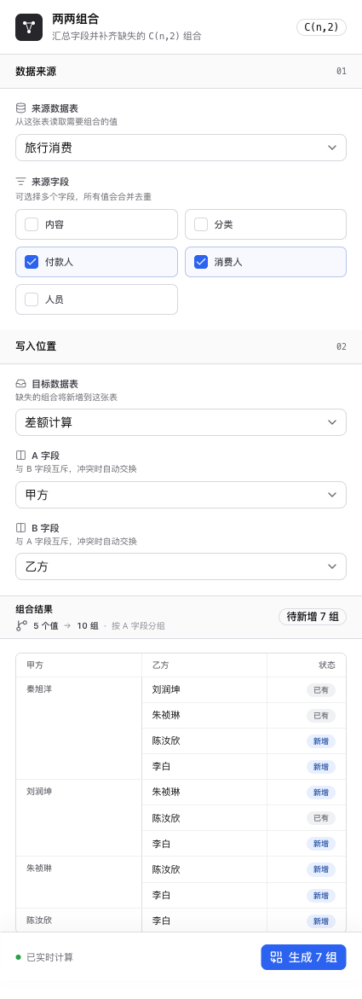

# 两两组合

飞书多维表格边栏插件：跨字段汇总数据、去重，并补齐缺失的无序两两组合。



## 能力

- 来源表、来源字段和目标字段可配置
- 支持文本、单选、多选和人员字段
- 自动识别已有组合，只新增缺失记录
- 200 条一批写入，适配多维表格批量接口限制

## 开发

```bash
bun install
bun run check
bun run dev
```

提交前 Husky 会自动执行完整检查：oxfmt、oxlint、TypeScript、测试和生产构建。
